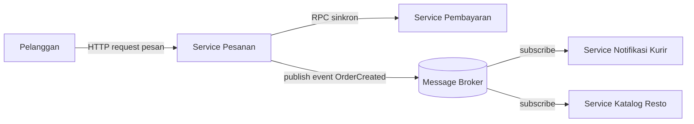

# Tugas 2 (Pekan 2) — Perancangan Arsitektur untuk FoodGo

**Materi terkait:** Architectural style (Layered, SOA, Peer-to-Peer, Publish-Subscribe).

## Studi Kasus

Melanjutkan Tugas 1: FoodGo butuh sistem yang **decoupled** agar tim kurir dan tim resto tidak saling mengganggu ketika salah satu modul diperbarui/deploy ulang. Saat ini semua modul (pesanan, pembayaran, notifikasi kurir, katalog resto) berjalan sebagai satu aplikasi monolitik — sekali deploy, semua modul ikut restart dan berisiko downtime total.

## Tugas Kelompok

1. Pilih **satu** gaya arsitektur utama: **Service-Oriented Architecture (SOA)** atau **Publish-Subscribe**. Boleh dikombinasikan (mis. SOA untuk service inti + Pub-Sub untuk notifikasi), tapi harus dijustifikasi kenapa kombinasi ini yang dipilih.
2. Gambarkan minimal 4 komponen berikut dan interaksinya: modul Pesanan, modul Pembayaran, modul Kurir/Notifikasi, modul Katalog Resto (dan message broker/API gateway jika relevan).
3. Jelaskan alur satu skenario penuh secara end-to-end di diagram (misalnya: pelanggan buat pesanan → bayar → resto terima notifikasi → kurir ditugaskan) — tunjukkan komponen mana berkomunikasi dengan siapa, dan **jenis komunikasinya** (sinkron/asinkron, request-response/event).
4. Analisis tertulis: kenapa gaya ini mengatasi masalah *coupling* dari Tugas 1, dan apa trade-off-nya (mis. Pub-Sub menambah kompleksitas debugging karena alur tidak linear).

## Jawaban Tugas Kelompok

1. Fungsi SOA dan Publish-Subscribe yang berbeda menjadi alasan kami memilih kombinasi ini untuk memenuhi kebutuhan FoodGo. SOA berfungsi untuk memisahkan fungsi utama FoodGo menjadi beberapa service yang bisa dikembangkan dan dideploy secara mandiri. Sedangkan Publish-service digunakan untuk komunikasi berbasis event secara asynchronous antar-servis. Kedua fungsi ini jika dikombinasikan memungkinan proses yang membutuhkan respon secara langung dapat menggunakan komunikasi langsung, sedangkat proses seperti notifikasi dapat melalui event secara asynchronous.
2. Sistem FoodGo terdiri dari beberapa komponen yang memiliki fungsi berbeda, yaitu:
    - Pelanggan: Pengguna yang melakukan navigasi menu dan pemesanan.
    - Modul Katalog Resto: Menyediakan informasi mengenai restoran dan daftar menu.
    - Modul Pesanan: Membuat dan mengelola pesanan dari pelanggan.
    - Modul Pembayaran: Menangani proses pembayaran dan verifikasi transaksi.
    - Modul Resto: Menerima informasi pesanan untuk diproses oleh pihak restoran.
    - Modul Kurir/Notifikasi: Menangani penugasan kurir serta mengirim notifikasi.
    - Message Broker: Sebagai perantara dalam penyampaian event secara asinkron antar-modul menggunakan pola Publish-Subscribe.

    Diagram foodgo:  
      

3. Alur skenario secara end-to-end:
    - Melihat Menu: Pelanggan meminta informasi menu kepada Service Katalog Resto, lalu Service Katalog Resto memberikan informasi menu sesuai permintaan pelanggan secara sinkron (request-response). Setelah itu, pelanggan memilih menu yang diinginkan.   
    - Membuat Pesanan: Setelah memilih menu, pelanggan membuat pesanan dan dikirimkan ke Service Pesanan secara sinkron (request-response). Service Pesanan kemudian menerima dan memproses data pesanan pelanggan.   
    - Proses Pembayaran: Service Pesanan mengirimkan permintaan pembayaran ke Service Pembayaran. Jika pembayaran berhasil, Service Pembayaran mengirim balik respon _"Bayar berhasil"_ ke Service Pesanan.   
    - Penerbitan Event: Service Pesanan mempublish event _OrderPaid_ setelah menerima konfirmasi bahwa pembayaran berhasil. Event ini dikirimkan ke _Message Broker_ menggunakan komunikasi asinkron (event).   
    - Menerima Event (Resto): Service Resto menerima (_subscribe_) event dari _Message Broker_ secara asinkron, sehingga pihak resto mengetahui bahwa pesanan telah dibayar dan siap diproses.   
    - Notifikasi & Kurir: Service Kurir/Notifikasi juga menerima (subscribe) event dari _Message Broker_ secara asinkron untuk memproses penugasan kurir serta pengiriman notifikasi.
4. Pada Tugas 1, FoodGo masih menggunakan satu aplikasi monolitik yang berisi beberapa fungsi sekaligus. Hal ini membuat perubahan pada satu bagian dapat ikut memengaruhi bagian lainnya. Dengan menggunakan SOA, fungsi FoodGo dipisahkan menjadi beberapa service seperti Service Pesanan, Service Pembayaran, Service Katalog Resto, Service Resto, dan Service Kurir/Notifikasi.
Selain itu, Publish-Subscribe digunakan untuk proses yang tidak membutuhkan respons secara langsung. Contohnya setelah pembayaran berhasil, Service Pesanan mengirim event OrderPaid ke Message Broker. Event tersebut kemudian dapat diterima oleh Service Resto dan Service Kurir/Notifikasi. Dengan cara ini, Service Pesanan tidak perlu berhubungan langsung dengan kedua service tersebut untuk setiap proses. Jadi, masing-masing service memiliki tugasnya sendiri dan tidak terlalu bergantung pada service lain. Jika ada perubahan pada Service Katalog Resto atau Service Kurir/Notifikasi, service lain tidak harus ikut diubah atau di-deploy ulang. Hal ini membuat sistem FoodGo lebih decoupled dibandingkan arsitektur monolitik.

Trade-off:
  - Sistem menjadi lebih kompleks
  Karena FoodGo memiliki beberapa service dan Message Broker, pengelolaannya menjadi lebih banyak dibandingkan ketika semua fungsi masih berada dalam satu aplikasi.

  - Proses asynchronous membutuhkan waktu
  Event yang dikirim melalui Message Broker tidak langsung diproses oleh service penerima pada saat yang sama. Misalnya, setelah pembayaran berhasil, Service Resto membutuhkan waktu untuk menerima dan memproses event OrderPaid.

  - Lebih sulit mencari sumber masalah
  Jika event `OrderPaid` tidak sampai atau tidak diproses dengan benar, perlu diperiksa dari Service Pesanan, Message Broker, sampai service yang menerima event tersebut. Jadi, proses mencari kesalahan bisa lebih panjang.

  - Perlu menangani event yang gagal
  Jika terjadi gangguan saat event diproses, FoodGo perlu memiliki mekanisme seperti *retry* atau penyimpanan pesan agar event tidak langsung hilang dan dapat diproses kembali.


## Cara Membuat Diagram (Gratis, Cukup Laptop)

Tidak perlu software berbayar. Dua opsi:

**Opsi A — Mermaid di dalam Markdown (disarankan).** Ditulis sebagai teks biasa di `README.md`, otomatis dirender jadi diagram oleh GitHub — tidak perlu install apa pun.

````markdown

````

**Opsi B — draw.io / diagrams.net** (gratis, jalan di browser tanpa akun, atau app desktop offline di [app.diagrams.net](https://app.diagrams.net/)). Ekspor sebagai `.png` dan simpan di folder `diagram/`.

## Struktur Submission

```
tugas-02-perancangan-arsitektur/
├── README.md          # Analisis + diagram Mermaid (jika Opsi A) atau referensi ke diagram/
├── JURNAL.md
└── diagram/            # File .png/.drawio jika pakai Opsi B
```

## Rubrik Penilaian (Tugas 2)

| Komponen | Bobot | Kriteria |
|---|---|---|
| Ketepatan pemilihan gaya arsitektur | 20% | Justifikasi SOA/Pub-Sub sesuai kebutuhan *decoupling* di skenario |
| Kelengkapan & kejelasan diagram | 30% | Semua komponen kunci ada, jenis komunikasi (sinkron/asinkron) jelas ditandai |
| Analisis trade-off | 30% | Bukan hanya kelebihan — kekurangan/kompleksitas baru juga dibahas |
| Proses & kontribusi kelompok | 20% | `JURNAL.md`, commit history |

## Batasan Penggunaan AI (Level 2)

Kebijakan **Level 2 (AI Assisted Idea Generation & Structuring)** berlaku — lihat [`../RUBRIK-UMUM.md`](../RUBRIK-UMUM.md). Boleh memakai AI untuk brainstorming komponen apa saja yang umum ada di gaya arsitektur SOA/Pub-Sub; **tidak boleh** meminta AI menggambar diagram final atau menuliskan analisis trade-off yang tinggal ditempel. Catat pemakaian AI di "Log Penggunaan AI" pada `JURNAL.md`.

- Diagram Mermaid/draw.io yang "terlalu generik" (identik dengan contoh tutorial di internet tanpa penyesuaian ke kasus FoodGo) akan dinilai rendah pada komponen kelengkapan & kejelasan diagram.
