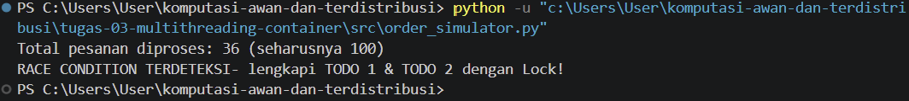
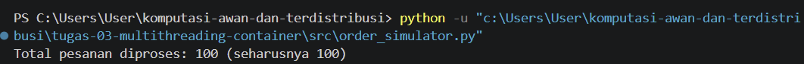

# Tugas 3 (Pekan 3) — Efisiensi Proses & Kontainer

**Materi terkait:** Threading, Virtualization, Containers.

## Studi Kasus

Server FoodGo boros sumber daya karena setiap permintaan pesanan masuk diproses sebagai **proses baru yang berat** (mis. `fork()` proses OS penuh per request). Saat 100 pesanan masuk bersamaan, server kehabisan memori karena tiap proses membawa overhead-nya sendiri.

## Tugas Kelompok

1. Implementasikan **simulasi pesanan masuk** di Python (`src/order_simulator.py`) yang memproses banyak pesanan **secara konkuren memakai multithreading** (bukan multiprocessing, bukan sekuensial biasa).

   **Jawaban:**
   - Program dibuat untuk mensimulasikan pemrosesan 100 pesanan menggunakan 10 worker thread, sesuai dengan nilai `NUM_ORDERS = 100` dan `NUM_WORKERS = 10` pada program.
   - Daftar pesanan dibuat menggunakan list(`range(1, NUM_ORDERS + 1)`), sehingga program menghasilkan nomor pesanan mulai dari 1 sampai 100.
   - Pesanan kemudian dibagi menjadi 10 bagian menggunakan chunk_size, sehingga setiap worker mendapatkan bagian pesanan yang berbeda untuk diproses.
   - Setiap bagian pesanan dijalankan menggunakan `threading.Thread()` dengan fungsi `worker()` sebagai tugas yang akan dijalankan oleh thread tersebut.
   - Seluruh thread dijalankan menggunakan `start()` sehingga beberapa bagian pesanan dapat diproses secara konkuren.
   - Setelah semua thread dijalankan, `join()` digunakan untuk menunggu seluruh thread menyelesaikan tugasnya sebelum program menampilkan jumlah pesanan yang berhasil diproses.
   - Fungsi `worker()` menjalankan `process_order()` untuk setiap pesanan yang sudah diberikan kepada worker, sehingga seluruh pesanan dapat diproses melalui thread yang telah dibuat.

   Multithreading dipilih karena FoodGo perlu menangani banyak pesanan yang bisa masuk dalam waktu yang sama. Pada kondisi awal, setiap pesanan diproses dengan membuat proses OS baru sehingga semakin banyak pesanan yang masuk, semakin besar pula memori dan sumber daya server yang digunakan. Hal ini dapat membuat server menjadi boros sumber daya dan berisiko kehabisan memori. Dengan multithreading, beberapa pesanan dapat dikerjakan secara bersamaan dalam satu proses tanpa harus membuat proses baru untuk setiap pesanan. Cara ini lebih sesuai untuk mengatasi masalah penggunaan sumber daya pada studi kasus FoodGo. Implementasinya dapat dilihat dari penggunaan `threading.Thread(), start(),` dan `join()` pada program.

2. Program harus mensimulasikan **race condition yang sengaja dibuat lalu diperbaiki** — buktikan pemahaman kalian tentang `Lock`/sinkronisasi dengan cara:
   - Jalankan dulu versi TANPA lock, tunjukkan hasil counter yang salah (screenshot/log).
   - Perbaiki dengan `threading.Lock()`, tunjukkan hasil counter yang benar.
   - Tulis perbandingan ini di `JURNAL.md`.
   
   **Jawaban:** 

      A. Simulasi Race Condition Tanpa Lock 
      Program menggunakan `processed_count` sebagai counter bersama untuk menghitung jumlah pesanan yang sudah diproses oleh seluruh thread. Percobaan pertama dilakukan tanpa menggunakan `Lock`. Pada kondisi ini, beberapa thread dapat membaca dan mengubah nilai `processed_count` pada waktu yang hampir bersamaan. Untuk membuat kondisi race condition terlihat dalam simulasi, terdapat jeda setelah nilai `processed_count` dibaca sebelum nilai tersebut ditambahkan dan disimpan kembali. Hal ini memungkinkan beberapa thread membaca nilai counter yang sama. Akibatnya, terdapat pembaruan nilai yang dapat saling tertimpa sehingga jumlah pesanan yang tercatat pada `processed_count` dapat lebih sedikit dari jumlah pesanan yang sebenarnya diproses. 

      Bukti Percobaan Tanpa Lock:
       
      
      B. Perbaikan Menggunakan `threading.Lock()` 
      Setelah percobaan tanpa `Lock`, program diperbaiki dengan membuat objek `Lock` menggunakan `threading.Lock()` untuk melindungi `processed_count`. Bagian pembaruan counter ditempatkan di dalam `with lock:,` sehingga hanya satu thread yang dapat mengubah `processed_count` pada satu waktu. Dengan adanya `Lock`, setiap thread harus menunggu sampai thread sebelumnya selesai memperbarui counter. Hal ini mencegah nilai `processed_count` tertimpa ketika beberapa thread bekerja secara bersamaan. Setelah menggunakan `Lock`, counter dapat mencatat seluruh pesanan yang berhasil diproses sehingga hasil akhirnya sesuai dengan jumlah 100 pesanan. 
      
      Bukti Percobaan Dengan Lock:
      
      
      C. Hasil percobaan tanpa Lock dan dengan Lock akan dibandingkan lebih lanjut pada JURNAL.md.

3. Paketkan program ke dalam **Docker container** (`Dockerfile` disediakan skeleton-nya, lengkapi bagian yang kosong).
   
   **Jawaban:**

      A. Bukti dockerfile
         FROM python:3.13-slim 
         
         WORKDIR /app 
         
         COPY requirements.txt . 
         RUN pip install --no-cache-dir -r requirements.txt 
         
         COPY src/ ./src/ 
         
         CMD ["python3", "src/order_simulator.py"]
      
      B. Penjelasan bukti dockerfile
      
         - Penggunaan image Python
            python:3.13-slim digunakan sebagai dasar container karena sudah menyediakan Python yang dibutuhkan untuk menjalankan program. Versi slim dipilih agar image yang digunakan tidak terlalu besar dan hanya membawa komponen yang diperlukan.
         - Menentukan folder kerja
            WORKDIR /app digunakan untuk menentukan lokasi kerja program di dalam container. Dengan adanya folder ini, perintah berikutnya seperti menyalin file dan menjalankan program akan menggunakan /app sebagai direktori utama.
         - Menyiapkan dependency
            File requirements.txt disalin terlebih dahulu ke dalam container. Setelah itu, dependency di-install menggunakan pip. Peletakan bagian ini sebelum COPY src/ juga membuat proses build lebih efisien ketika hanya terdapat perubahan pada kode program, karena bagian instalasi dependency dapat menggunakan cache Docker.
         - Memasukkan source code
            COPY src/ ./src/ digunakan untuk memasukkan folder src dari project ke dalam container. Dengan begitu, file order_simulator.py yang berada di dalam folder tersebut tersedia dan dapat dijalankan dari dalam container.
         - Menentukan program yang dijalankan
            CMD ["python3", "src/order_simulator.py"] digunakan untuk menentukan perintah utama ketika container dijalankan. Jadi, saat docker run dilakukan, container akan langsung menjalankan program simulasi pesanan menggunakan Python tanpa perlu memasukkan perintah tambahan.

4. Jalankan container di laptop, buktikan program tetap berjalan benar di dalam container (screenshot/video di `bukti/`).
   
   **Jawaban:**
      
      A. Build image

         docker build -t foodgo-order-sim .

      - Perintah ini digunakan untuk membuat Docker image dari Dockerfile yang sudah dibuat. Image tersebut diberi nama foodgo-order-sim.

      B. Menjalankan container

         docker run --rm foodgo-order-sim

      - Perintah ini digunakan untuk menjalankan program dari image foodgo-order-sim di dalam container. Opsi --rm digunakan agar container yang sudah selesai langsung dihapus.

      C. Hasilnya:

         Total pesanan diproses: 100 (seharusnya 100)

      - Hasil tersebut menunjukkan bahwa program berhasil dijalankan di dalam container dan 100 pesanan berhasil diproses sesuai dengan jumlah pesanan yang ditentukan.

## Skeleton yang Disediakan

- `src/order_simulator.py` — kerangka program dengan `# TODO` di bagian logika inti (worker function, penggunaan lock, agregasi hasil). **Kalian wajib mengisi bagian TODO sendiri** — ini bagian penilaian utama.
- `requirements.txt` — kosong/minimal (program ini sengaja hanya pakai standard library Python, tidak perlu dependency eksternal).
- `Dockerfile` — kerangka dengan beberapa baris `# TODO`, lengkapi agar image bisa di-build dan dijalankan.

## Cara Menjalankan (Setelah Skeleton Dilengkapi)

Tanpa Docker (langsung di laptop, untuk debugging cepat):
```bash
cd tugas-03-multithreading-container
python3 src/order_simulator.py
```

Dengan Docker (wajib untuk submission akhir):
```bash
cd tugas-03-multithreading-container
docker build -t foodgo-order-sim .
docker run --rm foodgo-order-sim
```

## Struktur Submission

```
tugas-03-multithreading-container/
├── README.md          # Analisis: race condition, perbaikan, kenapa threading (bukan multiprocessing/proses OS)
├── JURNAL.md           # Log sebelum/sesudah lock, error yang ditemui saat build Docker
├── Dockerfile
├── requirements.txt
├── src/
│   └── order_simulator.py
└── bukti/              # Screenshot/video: hasil counter salah (tanpa lock), hasil benar (dengan lock), container jalan
```

## Rubrik Penilaian (Tugas 3)

| Komponen | Bobot | Kriteria |
|---|---|---|
| Implementasi multithreading benar | 30% | Worker benar-benar konkuren (bukan `time.sleep` yang menyamarkan sekuensial), pakai `threading` |
| Bukti race condition & perbaikan lock | 25% | Ada bukti nyata (log/screenshot) sebelum & sesudah, bukan cuma klaim di teks |
| Dockerfile & eksekusi container | 20% | Image ter-build, container jalan dan hasilkan output yang sama seperti tanpa Docker |
| Analisis (kenapa threading, bukan proses berat) | 15% | Mengaitkan balik ke masalah "server boros resource" di studi kasus |
| Proses & kontribusi kelompok | 10% | `JURNAL.md`, commit history |

## Batasan Penggunaan AI (Level 2)

Kebijakan **Level 2 (AI Assisted Idea Generation & Structuring)** berlaku — lihat [`../RUBRIK-UMUM.md`](../RUBRIK-UMUM.md). Boleh bertanya ke AI soal opsi umum menangani race condition (mis. "apa saja cara sinkronisasi thread di Python"); **tidak boleh** meminta AI menuliskan isi bagian `# TODO` di `order_simulator.py`/`Dockerfile`. Catat pemakaian AI di "Log Penggunaan AI" pada `JURNAL.md`.

- Bagian `# TODO` di `order_simulator.py` dan `Dockerfile` sengaja dikosongkan — solusi yang identik persis antar kelompok (termasuk nama variabel, komentar) akan diperiksa lebih lanjut.
- `JURNAL.md` wajib menunjukkan bukti nyata percobaan **sebelum** (race condition muncul) dan **sesudah** (`Lock()` dipasang) — bukan cuma klaim tanpa data pembanding.
